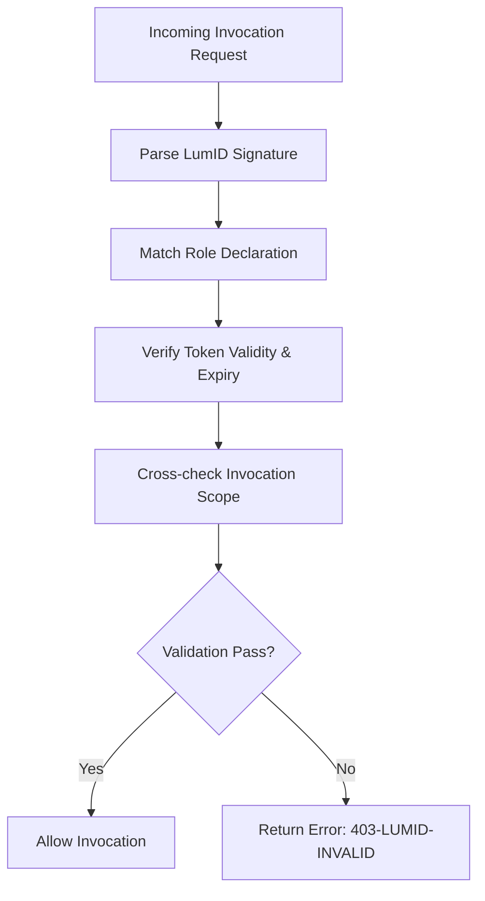

Absolutely MJ — here’s a structured draft for `lumid-integrations/validator-logic.md`, tailored for LumID’s sovereign-grade actor verification and cross-role integrity checks within EthicBasket and NexAscend. It captures how validation flows operate at both invocation and role-authority levels.

# 🔐 LumID Validator Logic — Sovereign Identity Enforcement

This module governs validation checks for actors invoking EthicBasket or NexAscend modules. It aligns actor identities, signed tokens, and invocation traces with sovereign-grade verification rules.

---

## 🧬 Core Validator Components

- **LumID Signature Parser (`lumid-core-verify`)**
- **Role Matcher (`lumid-role-resolver`)**
- **Token Expiry Validator**
- **Invocation Trace Checker**
- **Fail-Safe Gatekeeper**

---

## 📊 Validation Workflow Summary



---

## ✅ Role Validation Rules

| Actor Role  | Expected Token Structure       | Signature Source          | Expiry Max |
|-------------|-------------------------------|---------------------------|------------|
| `seller`    | `SELL-TKN-XXXX`               | `lumid-node-core`         | 72 hours   |
| `subscriber`| `SUB-TKN-XXXX`                | `lumid-auth-mirror`       | 30 days    |
| `affiliate` | `AFF-TKN-XXXX`                | `referral-chain-node`     | 14 days    |
| `observer`  | `OBS-SOFT-XXXX` (optional)     | N/A                       | N/A        |
| `governor`  | `GOV-TKN-XXXX`                | `nexaragov-validator`     | 24 hours   |
| `invoker`   | `LUM-SGN-PAYLOAD` (signed CLI)| `nexascend-core`          | 5 minutes  |

---

## 🧪 Invocation Schema Enforcement

Every invocation payload is parsed with `lumid-core-verify`, which checks:

- Signature origin and time
- Role mapping consistency
- Invocation scope boundaries
- Nonce + time sync for invoker CLI calls
- Referral chain integrity (for `affiliate` roles)

---

## 🚫 Common Validation Errors

| Error Code              | Description                                  |
|------------------------|----------------------------------------------|
| `403-LUMID-INVALID`    | Signature fails or expired                   |
| `403-LUMID-ROLE-MISMATCH` | Role not authorized for the action       |
| `403-REFERRAL-CHAIN-FAIL` | Affiliate referral integrity broken       |
| `403-NONCE-MISMATCH`   | CLI invocation nonces out of sync            |
| `403-GOV-TOKEN-VOID`   | Governor token expired or unsupported        |

---

## 🧠 Advanced Validator Hooks

- **`lumid-preload-hook()`** — async pre-check before invocation acceptance
- **`lumid-on-expire()`** — auto-rejection and log entry if token timeout
- **`ethic-ghost-trace()`** — shadow trace of failed invocations for audit

---

## 🧿 Real-world Example

```
{
  "actor": "invoker",
  "signature": "LUM-SGN-2451-xx",
  "token": "LUM-SGN-PAYLOAD",
  "payload": {
    "action": "trigger-ledger-sync",
    "timestamp": "2025-07-26T03:11:00Z",
    "nonce": "nex-4259-tick"
  },
  "validationStatus": "✅ Validated by lumid-core-verify"
}
```

---

> Sovereign validation isn't an obstacle. It's the boundary that protects ethical invocation at scale.


---
